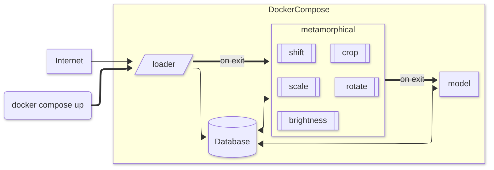

# MetaXplain
The aim of this project is to investigate how metamorphic testing together with explainable AI, can be used to evaluate an AI model.

```mermaid
---
config:
  layout: elk
  look: neo
---
flowchart LR
 subgraph metamorphical["metamorphical"]
    direction TB
        shift["shift"]
        crop["crop"]
        scale["scale"]
        brightness["brightness"]
        rotate["rotate"]
  end
 subgraph DockerCompose["DockerCompose"]
    direction TB
        metamorphical
        database[("Database")]
        loader["loader"]
        model["model"]
  end
    loader --> database
    database <--> metamorphical & model
    Internet["Internet"] --> loader

    User["docker compose up"] ==> loader 
    loader == on exit ==> metamorphical
    metamorphical == on exit ==> model
    shift@{ shape: subproc}
    crop@{ shape: subproc}
    scale@{ shape: subproc}
    brightness@{ shape: subproc}
    rotate@{ shape: subproc}
    loader@{ shape: lean-r}
    User@{ shape: rounded}
```
