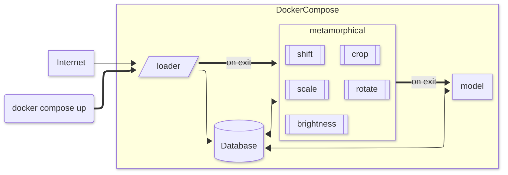

# MetaXplain
The aim of this project is to investigate how metamorphic testing together with explainable AI, can be used to evaluate an AI model.

Below you can see the architecture of the project.


## How to run

### Prerequsite

This project is based on docker and, specifically, docker compose. This means you need docker on your computer. This can be downloaded as docker engine on windows or `sudo apt install docker` on ubuntu. While python is good to have on your computer, it is not a requirement. Pyhon would, techincally, allow you to run each container indivudally. However, it's mostly used for the visualization part of the project. You can find a requriment files close to any python script. For example, each container has its own requirements file and the file for visualization can be found in the root level. To install the requriments for visualization run: `pip install -r requirements.txt`

###  commands 

The makefile has some helpful commands for using the project, below you can see them and it can also be run in your terminal by typing `make [COMMAND]` 

```bash
compose                        Run the docker compose
database                       Start only the database
dataset                        Load the dataset into the database
help                           Show this help
meta                           Run the methamorphical container
model                          Run the neural network
```

To "simply" run the project, just type `make compose` and wait until all containers have finished running. You can observe the progress through docker commands or through the logs which the model container will output on the root layer. After completion you can run visualize to see a selection of useful visualizations for the project.